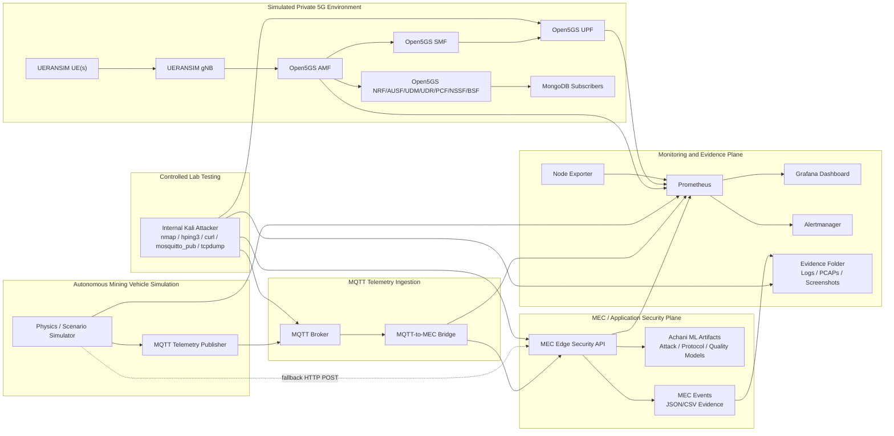

# 5G Security Testing for Autonomous Mining Vehicles

**COMP6016 — Computer Science Project 2 | Curtin University | Semester 1, 2026**

A production-inspired **simulated private 5G/MEC cybersecurity prototype** for autonomous mining vehicle telemetry. The project uses Open5GS, UERANSIM, Docker, a physics/scenario-based telemetry simulator, MQTT-based telemetry ingestion, a MEC Edge Security API, Prometheus, Grafana, Kali-based controlled testing, and evidence collection to demonstrate how mining vehicle telemetry can be monitored, validated, attacked in a safe lab, and visualised.

> **Important scope statement:** This is a simulated university/portfolio testbed. It is not a production-ready mining-site deployment, not a real private 5G hardware deployment, and not a real attack against production infrastructure. All security testing is controlled, local, and lab-only.

---

## Project Objective

The objective is to build a repeatable 5G/MEC cybersecurity testbed that can:

- Simulate autonomous mining vehicle telemetry.
- Represent a private 5G-style network using Open5GS and UERANSIM.
- Ingest telemetry through HTTP and the planned MQTT telemetry path.
- Validate telemetry at a MEC Edge API.
- Detect tampered, replay-like, abnormal, or degraded telemetry behaviour.
- Visualise 5G, vehicle, MEC, AI, and attack evidence in Grafana.
- Generate evidence through logs, Prometheus metrics, MEC events, PCAPs, and screenshots.
- Support academic reporting, portfolio demonstration, and ACS/SFIA-style skills evidence.

---

## Team — Group 1

| Name | Student ID | Main Role |
|---|---:|---|
| Hirdya Sharma | 21749180 | Infrastructure integration, telemetry pipeline, MEC Edge API, scenario testing, internal Kali testing, evidence workflow |
| Deepika Sharma | 21952195 | Grafana dashboards, Prometheus observability, threat/MITRE-style visualisation |
| Achani Bandara | 21741102 | ML model training, model artifacts, AI output metrics |
| Hitesh Pankhania | 22471264 | Attack execution and packet capture |
| Gurleen Kaur | 22131597 | Attack simulation and Wireshark analysis |

**Supervisors:** Dr. Nasim Ferdosian · Dr. Reza Ryan

---

## Current System Scope

The current project demonstrates the following working or planned components:

| Area | Current Status |
|---|---|
| Open5GS 5G core | Dockerised simulated 5G core using Open5GS network functions |
| UERANSIM | Simulated gNB and UE instances |
| Telemetry simulator | Physics/scenario-based mining vehicle telemetry generation |
| MEC Edge API | Receives telemetry, validates values, exposes metrics/events |
| Achani ML artifacts | Integrated into MEC for attack/protocol/traffic quality outputs where available |
| Prometheus | Scrapes telemetry, MEC, Open5GS, node, and dashboard metrics |
| Grafana | Visualises 5G planes, vehicle telemetry, MEC security, AI outputs, Kali evidence, scenario metrics |
| Kali attacker | Internal Docker-network attacker for controlled lab testing |
| MQTT telemetry path | Planned/implemented upgrade for realistic industrial telemetry ingestion |
| Evidence generation | Logs, PCAPs, metrics, MEC events, screenshots, and test summaries |

---

## High-Level Architecture



A separate SVG version of the architecture is available in:

```text
docs/architecture.svg
```

---

## Architecture Planes

The project is explained using four main planes.

### 1. 5G Control Plane

Includes Open5GS and UERANSIM components involved in simulated UE/gNB registration and core network service state.

Examples:

- UERANSIM gNB and UE containers.
- Open5GS AMF, SMF, NRF, AUSF, UDM, UDR, PCF, NSSF, BSF.
- AMF/UPF Prometheus target availability.
- UE recovery or rogue/misconfigured UE testing as controlled evidence.

### 2. 5G User Plane

Represents user-plane visibility through UPF-facing traffic and vehicle network metrics.

Examples:

- UPF target status.
- UDP/GTP-U-facing traffic test against UDP/2152.
- RTT, packet loss, uplink throughput, downlink throughput.
- PCAP evidence of Kali-to-UPF traffic.

### 3. MEC / Application Security Plane

The MEC API receives telemetry and applies security checks.

Examples:

- Tamper detection.
- Rejected telemetry.
- Replay-like behaviour detection where available.
- Anomaly score.
- Traffic quality prediction.
- Attack/protocol prediction.
- Event export through `/events`.

### 4. Monitoring and Evidence Plane

Provides observability and proof.

Examples:

- Prometheus metrics.
- Grafana dashboards.
- Alertmanager.
- Node Exporter.
- PCAP captures.
- MEC event logs.

---

## Updated Telemetry Flow

### Original Stable Flow

```text
Physics Simulator
      ↓ HTTP POST /telemetry
MEC Edge API
      ↓ /metrics + /events
Prometheus
      ↓
Grafana
```

### MQTT-First Target Flow

```text
Scenario / Physics Simulator
      ↓ MQTT publish
MQTT Broker
      ↓ subscribe
MQTT-to-MEC Bridge
      ↓ HTTP POST /telemetry
MEC Edge Security API
      ↓ metrics + events
Prometheus + Grafana + Evidence Folder
```

MQTT is being introduced as the realistic industrial telemetry ingestion layer. The direct HTTP path can remain as a stable fallback, but the intended project direction is to demonstrate telemetry entering through MQTT topics and then being validated by the MEC layer.

Example MQTT topics:

```text
mining/vehicles/MV-001/telemetry
mining/vehicles/MV-002/telemetry
mining/vehicles/MV-003/telemetry
mining/vehicles/MV-MQTT-TAMPER/telemetry
```

---

## Why MQTT Improves the Project

MQTT makes the project closer to an industrial IoT/mining telemetry pattern. Instead of every vehicle directly calling one API, vehicles publish to a broker. A bridge then subscribes to telemetry topics, validates message structure, and forwards messages to MEC.

MQTT enables:

- Multi-vehicle telemetry ingestion.
- Topic-based telemetry separation.
- Decoupling between vehicles and MEC.
- MQTT tamper/replay test cases.
- Bridge-level metrics such as received, forwarded, invalid, and latency.
- A more scalable future architecture.

Expected MQTT bridge metrics:

```text
mqtt_telemetry_messages_total
mqtt_telemetry_forwarded_total
mqtt_telemetry_invalid_total
mqtt_bridge_forward_latency_ms
mqtt_last_message_timestamp
```

---

## Security Testing Model

The project separates attack/testing paths clearly.

| Attack/Test Type | Path | Purpose | Evidence |
|---|---|---|---|
| TCP SYN pressure | Kali → MEC API | API/network pressure visibility | Host RX/TX, PCAP, MEC health |
| UDP/2152 UPF-facing test | Kali → UPF | User-plane-facing traffic visibility | PCAP, UPF availability, network spike |
| ICMP pressure | Kali → MEC/UPF | Latency/reachability pressure | PCAP, RTT/scenario panels |
| Slow HTTP pressure | Kali → MEC API | HTTP/API resilience test | MEC health, response impact |
| MQTT valid telemetry | Kali/simulator → MQTT → MEC | Realistic telemetry ingestion | MQTT counters, MEC acceptance |
| MQTT tamper telemetry | Kali/simulator → MQTT → MEC | Data integrity detection | Tamper/rejected counters, MEC events |
| Replay-style telemetry | MQTT or HTTP repeated payloads | Stateful/replay-like detection | MEC events, future replay counter |
| Scenario degradation | Scenario simulator → MQTT/HTTP → MEC | Cyber-physical impact simulation | RTT/loss/throughput/RSRP/SINR panels |

> The Kali tests generate real traffic inside the local Docker testbed. The scenario simulator represents the expected operational effect on vehicle telemetry. The MEC and Grafana layers then show detection, classification, and evidence.

---

## Current Runtime Ports

| Service | Container Port | Host Port |
|---|---:|---:|
| MEC Edge API | 5000 | 5001 |
| Physics Simulator | 8000 | 8000 |
| Scenario Simulator Control API | 8010 | 8010 |
| Scenario Simulator Metrics | 8001 | 8001 |
| Prometheus | 9090 | 9190 |
| Node Exporter | 9100 | 9110 |
| Alertmanager | 9093 | 9093 |
| Grafana | 3000 | 3000 |
| MQTT Broker | 1883 | 1883 |
| MQTT-to-MEC Bridge Metrics | 8020 | 8020 |
| AMF SCTP | 38412/sctp | 38413/sctp |

> Use `http://localhost:5001/health` for MEC health checks. The MEC container listens on port 5000, but the host port is 5001.

---

## Internal Network Map

| Container | IP |
|---|---|
| mongo | 10.0.0.2 |
| open5gs-nrf | 10.0.0.10 |
| open5gs-ausf | 10.0.0.11 |
| open5gs-udm | 10.0.0.12 |
| open5gs-udr | 10.0.0.13 |
| open5gs-pcf | 10.0.0.14 |
| open5gs-nssf | 10.0.0.15 |
| open5gs-bsf | 10.0.0.16 |
| open5gs-amf | 10.0.0.20 |
| open5gs-smf | 10.0.0.21 |
| open5gs-upf | 10.0.0.22 |
| ueransim-gnb | 10.0.0.30 |
| ueransim-ue1 | 10.0.0.31 |
| ueransim-ue2 | 10.0.0.32 |
| ueransim-ue3 | 10.0.0.33 |
| telemetry-simulator | 10.0.0.40 |
| scenario-simulator | 10.0.0.41 |
| mec-edge | 10.0.0.45 |
| prometheus | 10.0.0.50 |
| node-exporter | 10.0.0.51 |
| alertmanager | 10.0.0.53 |
| grafana | 10.0.0.60 |
| kali-attacker | 10.0.0.70 |
| mqtt-broker | 10.0.0.80 |
| mqtt-to-mec-bridge | 10.0.0.81 |

---

## Recommended Repository Structure

```text
5g-testing-autonomous-mining-vehicles/
├── README.md
├── docker-compose.yml
├── .env.example
├── setup.sh
├── test_everything_week10_11.sh
│
├── config/
│   ├── open5gs/
│   └── ueransim/
│
├── telemetry/
│   ├── physics_simulator_real.py
│   ├── scenario_controlled_simulator.py
│   ├── requirements.txt
│   └── README.md
│
├── mec/
│   ├── mec_edge_api.py
│   ├── mec_config.json
│   ├── requirements.txt
│   ├── model_attack.pkl
│   ├── model_protocol.pkl
│   ├── model_quality.pkl
│   └── scaler.pkl
│
├── mqtt/
│   ├── config/
│   │   └── mosquitto.conf
│   ├── data/
│   └── log/
│
├── mqtt_bridge/
│   ├── mqtt_to_mec_bridge.py
│   └── requirements.txt
│
├── monitoring/
│   ├── prometheus.yml
│   ├── alerts.yml
│   ├── alertmanager.yml
│   └── grafana/
│       ├── provisioning/
│       └── dashboards/
│           └── mining5g_final_dashboard.json
│
├── attacks/
│   ├── automated_demo_attack_proof.sh
│   ├── live_manual_attack_sequence.sh
│   ├── send_ai_attack_samples.sh
│   └── README.md
│
├── docs/
│   ├── architecture.md
│   ├── architecture.svg
│   ├── project_flow.md
│   ├── setup_guide.md
│   ├── demo_plan.md
│   ├── security_test_plan.md
│   ├── acs_sfia_mapping.md
│   ├── limitations.md
│   └── troubleshooting.md
│
├── evidence/
│   ├── .gitkeep
│   └── README.md
│
│
└── archive/
    ├── old_dashboards/
    ├── old_mec_versions/
    └── old_test_outputs/
```

---

## Quick Start

### 1. Start the stack

```bash
docker compose up -d --build
docker compose ps
```

### 2. Check MEC health

```bash
curl http://localhost:5001/health
```

### 3. Check Prometheus targets

```bash
curl http://localhost:9190/api/v1/targets
```

### 4. Open Grafana

```text
http://localhost:3000
```

Default lab credentials if configured:

```text
Username: admin
Password: mining5g@secure
```

### 5. Check AMF and UPF monitoring

```bash
curl -s "http://localhost:9190/api/v1/query?query=up%7Bjob%3D%22open5gs-amf%22%7D" | python3 -m json.tool
curl -s "http://localhost:9190/api/v1/query?query=up%7Bjob%3D%22open5gs-upf%22%7D" | python3 -m json.tool
```

Expected:

```text
"value": [..., "1"]
```

---

## Scenario Simulator

The scenario simulator allows repeatable testing of operating and attack-like conditions.

Example scenario commands:

```bash
curl -X POST http://localhost:8010/scenario/normal
curl -X POST http://localhost:8010/scenario/network_congestion
curl -X POST http://localhost:8010/scenario/signal_degradation
curl -X POST http://localhost:8010/scenario/tcp_syn_like
curl -X POST http://localhost:8010/scenario/udp_like
curl -X POST http://localhost:8010/scenario/icmp_like
curl -X POST http://localhost:8010/scenario/tamper
curl -X POST http://localhost:8010/scenario/replay
```

Expected scenario metrics:

```text
scenario_mode_code
scenario_vehicle_rtt_ms
scenario_vehicle_packet_loss_percent
scenario_vehicle_rsrp_dbm
scenario_vehicle_sinr_db
scenario_vehicle_throughput_ul_mbps
scenario_vehicle_throughput_dl_mbps
scenario_vehicle_speed_kmh
scenario_vehicle_payload_tons
```

---

## MQTT Telemetry Testing

### Valid telemetry publish

```bash
docker exec kali-attacker mosquitto_pub -h 10.0.0.80 \
  -t "mining/vehicles/MV-MQTT-DEMO/telemetry" \
  -m '{"vehicle_id":"MV-MQTT-DEMO","speed_kmh":25,"fuel_liters":900,"battery_percent":82,"engine_temp_c":85,"rsrp_dbm":-70,"rtt_ms":20,"packet_loss_percent":0.5,"payload_tons":70,"sinr_db":24,"ul_mbps":18,"dl_mbps":80}'
```

Expected:

- MQTT message count increases.
- MQTT bridge forwards to MEC.
- MEC accepts telemetry.
- Grafana MQTT panels update.

### Tampered MQTT telemetry publish

```bash
docker exec kali-attacker mosquitto_pub -h 10.0.0.80 \
  -t "mining/vehicles/MV-MQTT-TAMPER/telemetry" \
  -m '{"vehicle_id":"MV-MQTT-TAMPER","speed_kmh":999,"fuel_liters":2400,"battery_percent":82,"engine_temp_c":85,"rsrp_dbm":-70,"rtt_ms":20,"packet_loss_percent":0.5,"payload_tons":250,"sinr_db":24,"ul_mbps":18,"dl_mbps":80}'
```

Expected:

- MQTT bridge receives and forwards the payload.
- MEC rejects physically impossible telemetry.
- `mec_tamper_detected_total` increases.
- `mec_telemetry_rejected_total` increases.
- MEC events record the rejection.

---

## Kali Controlled Testing

### TCP SYN pressure against MEC

```bash
timeout 10s docker exec kali-attacker hping3 -S --flood -p 5000 10.0.0.45
```

Expected:

- Host RX/TX spike.
- PCAP evidence of Kali to MEC TCP traffic.
- MEC remains available.
- Scenario can be switched to `tcp_syn_like`.

### UDP/UPF-facing test

```bash
timeout 10s docker exec kali-attacker hping3 --udp --flood -p 2152 10.0.0.22
```

Expected:

- UDP/2152 traffic toward UPF.
- UPF remains monitored.
- PCAP evidence of Kali to UPF traffic.
- Scenario can be switched to `udp_like`.

### ICMP pressure

```bash
timeout 10s docker exec kali-attacker hping3 --icmp --flood 10.0.0.45
```

Expected:

- ICMP traffic visible in PCAP.
- Host network spike.
- Scenario can be switched to `icmp_like`.

---

## Evidence Automation

Run:

```bash
./attacks/automated_demo_attack_proof.sh
```

Expected output folder:

```text
evidence/final_demo/demo_proof_TIMESTAMP/
├── logs/
├── metrics/
├── pcaps/
├── mqtt/
├── TEST_SUMMARY.md
└── screenshots_to_take.md
```

This script should collect:

- Docker service state.
- Prometheus AMF/UPF UP status.
- Baseline and post-attack metrics.
- Kali attack logs.
- PCAP files.
- MEC events.
- MQTT proof if enabled.
- Final test summary.

---

## Grafana Dashboard Sections

The final dashboard should include:

1. Live Demo Summary.
2. 5G Control Plane.
3. 5G User Plane.
4. Vehicle Telemetry.
5. Scenario Simulator.
6. MEC Security Detection.
7. Achani AI Model Detection.
8. Deepika Threat/MITRE Evidence.
9. MQTT Telemetry Ingestion.
10. Internal Kali Attack Evidence.

Avoid keeping unsupported or duplicated panels in the final demo dashboard.

---

## Key Metrics

### Vehicle and Network Metrics

```text
mining_vehicle_rtt_ms
mining_vehicle_packet_loss_percent
mining_vehicle_rsrp_dbm
mining_vehicle_sinr_db
mining_vehicle_throughput_ul_mbps
mining_vehicle_throughput_dl_mbps
mining_vehicle_speed_kmh
mining_vehicle_payload_tons
```

### MEC / AI Metrics

```text
mec_attack_prediction
mec_attack_predictions_total
mec_protocol_prediction
mec_traffic_quality
mec_achani_flag
mec_anomaly_score
mec_tamper_detected_total
mec_telemetry_rejected_total
```

### MQTT Metrics

```text
mqtt_telemetry_messages_total
mqtt_telemetry_forwarded_total
mqtt_telemetry_invalid_total
mqtt_bridge_forward_latency_ms
mqtt_last_message_timestamp
```

### 5G Plane Metrics

```text
up{job="open5gs-amf"}
up{job="open5gs-upf"}
scrape_duration_seconds{job="open5gs-amf"}
scrape_duration_seconds{job="open5gs-upf"}
```

---

---

## Demonstration Flow

### Mock / Short Demo

1. Show architecture diagram.
2. Show `docker compose ps`.
3. Show Prometheus AMF/UPF targets UP.
4. Show Grafana baseline.
5. Publish valid MQTT telemetry.
6. Publish tampered MQTT telemetry.
7. Show MQTT bridge counters and MEC tamper/rejected counters.
8. Run one Kali TCP or UDP test.
9. Show network spike and PCAP/evidence.
10. Return scenario to normal.

### Final Oral Demo

1. Introduce problem and motivation.
2. Explain 5G control/user/MEC/monitoring planes.
3. Show baseline dashboard.
4. Demonstrate MQTT valid telemetry.
5. Demonstrate MQTT tamper telemetry.
6. Demonstrate Kali TCP SYN or UDP/2152 test.
7. Demonstrate scenario degradation.
8. Show MEC/AI detection metrics.
9. Show evidence folder and PCAPs.
10. Explain scalability, limitations, and production roadmap.

---

## Scalability

The project can be scaled by evolving from a single Docker-based prototype into a modular edge/cloud architecture. More vehicles can be added by giving each simulated vehicle its own ID, telemetry profile, and MQTT topic. MQTT allows multiple telemetry publishers to send data to a broker, while the MQTT-to-MEC bridge can be scaled into multiple consumers or worker services. The MEC API can be replicated behind a load balancer, while shared state such as replay detection and rate limiting can be stored in Redis or another central state store.

For larger deployments, telemetry and event history could be stored in TimescaleDB, PostgreSQL, or object storage. Prometheus could be extended with Thanos, Cortex, or Mimir for long-term multi-site metrics. A production-grade security operations layer could later be added using Wazuh, Elastic, Splunk, or Microsoft Sentinel if required. In a mining environment, each site could run a local edge/MEC stack close to the vehicles, while alerts and summaries are forwarded to a central SOC or cloud dashboard.

---

## Production-Grade Roadmap

To become production-grade, the project would require:

- Real private 5G hardware or industrial 5G modems.
- Real gNB/small cell and SIM/eSIM provisioning.
- Real vehicle telemetry from CAN bus, PLC, GPS, IMU, or industrial sensors.
- MQTT authentication, TLS/mTLS, and topic-level access control.
- API authentication and secure telemetry signing.
- Hardened MEC deployment.
- Optional production SOC integration if required.
- Larger labelled datasets.
- Model validation and false-positive analysis.
- Safety controls and operational procedures.
- Kubernetes or edge orchestration.
- Backup, recovery, alert escalation, and incident response workflows.

---

## Limitations

- The current environment is simulated using Open5GS, UERANSIM, Docker, and synthetic telemetry.
- It does not use real mining vehicles or real 5G radio hardware.
- Some attack impacts are represented using scenario-controlled telemetry degradation.
- Kali traffic is real within the Docker lab, but it is not a production network attack.
- The AI/model output depends on the telemetry features available to the MEC layer.
- Production use would require stronger authentication, encryption, hardware validation, safety controls, and optional production SOC integration.

---

## Ethical Use Statement

All testing in this project is performed inside a local, private, controlled Docker/VM lab. No public IPs, third-party systems, production networks, or real mining systems are targeted. The purpose is defensive research, academic demonstration, security monitoring, and portfolio evidence.

---

## Final Project Summary

This project demonstrates a simulated but practical private 5G/MEC cybersecurity testbed for autonomous mining vehicle telemetry. It combines 5G simulation, telemetry generation, MQTT-style ingestion, MEC validation, AI/anomaly outputs, controlled Kali testing, Prometheus/Grafana monitoring, and evidence collection. The project is not production-ready, but it provides a clear and defensible prototype showing how mining vehicle telemetry could be monitored, tested, and protected in a future private 5G/MEC environment.

