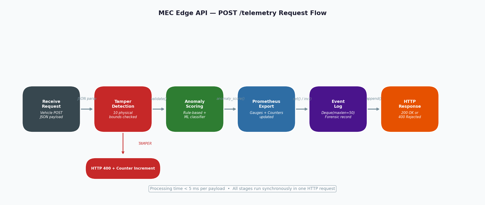
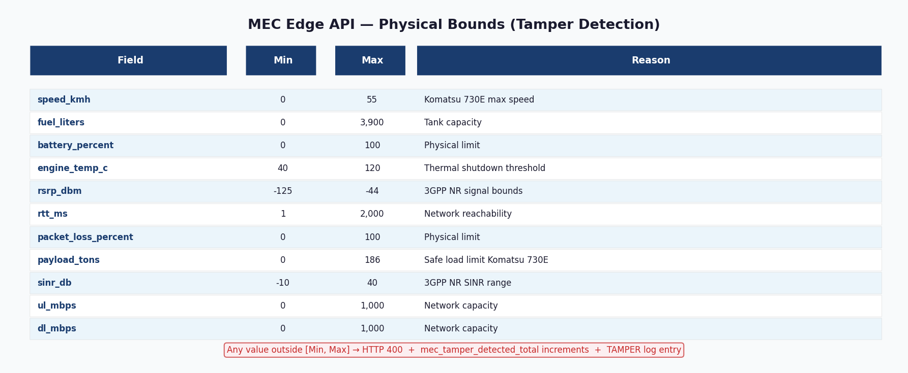
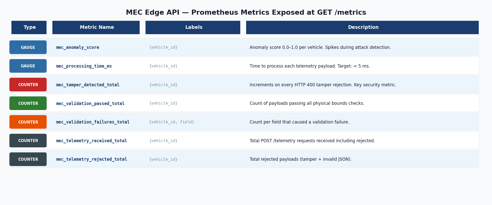
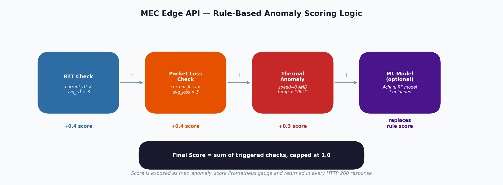

# 5G Security Testing for Autonomous Mining Vehicles

> **COMP6016 — Computer Science Project 2 | Curtin University | Semester 1, 2026**

A real-time intrusion detection system for autonomous haul trucks operating over a private 5G network at an open-cut platinum mine. The system simulates a complete 5G infrastructure, models three Komatsu 730E haul trucks using physics-accurate telemetry, processes all data through a Multi-access Edge Computing (MEC) API with tamper detection, and visualises everything live in Grafana.


---

## Team — Group 1

| Name | Student ID | Role |
|---|---|---|
| **Hirdya Sharma** | 21749180 | Physics simulator, MEC Edge API, full infrastructure, dataset pipeline |
| Deepika Sharma | 21952195 | Grafana dashboards, Prometheus observability |
| Achani Bandara | 21741102 | ML model training (Isolation Forest + Random Forest) |
| Hitesh Pankhania | 22471264 | Real attack execution (hping3 A1–A7), pcap capture |
| Gurleen Kaur | 22131597 | Attack simulation, Wireshark forensic analysis |

**Supervisors:** Dr. Nasim Ferdosian · Dr. Reza Ryan

---

## Table of Contents

1. [Project Overview](#1-project-overview)
2. [System Architecture](#2-system-architecture)
3. [Network Map](#3-network-map)
4. [Quick Start — Fresh Ubuntu](#4-quick-start--fresh-ubuntu)
5. [Component Breakdown](#5-component-breakdown)
   - [5G Core — Open5GS](#51-5g-core--open5gs)
   - [UE Simulation — UERANSIM](#52-ue-simulation--ueransim)
   - [Physics Simulator](#53-physics-simulator)
   - [MEC Edge API](#54-mec-edge-api)
   - [Observability Stack](#55-observability-stack)
   - [ML Models](#56-ml-models)
6. [Grafana Dashboard](#6-grafana-dashboard)
7. [Dataset](#7-dataset)
8. [Attack Scenarios](#8-attack-scenarios)
9. [Known Bugs Fixed](#9-known-bugs-fixed)
10. [Troubleshooting](#10-troubleshooting)
11. [Verify Everything Works](#11-verify-everything-works)
12. [File Structure](#12-file-structure)
13. [Scope and Limitations](#13-scope-and-limitations)
14. [References](#14-references)

---

## 1. Project Overview

### Why This Exists

Mining vehicles are increasingly autonomous and connected. A Komatsu 730E haul truck is a $5M+ asset. If an attacker can inject false telemetry, jam the 5G radio, or impersonate a vehicle on the network, the consequences range from operational disruption to physical collision. This project tests whether a 5G edge computing layer can detect those attacks in real time.

### What Was Built in COMP6015 vs COMP6016

| | COMP6015 (Previous) | COMP6016 (This Project) |
|---|---|---|
| Telemetry | Random number generator | Newtonian physics model (real Komatsu 730E specs) |
| Data validity | Statistically invalid (uncorrelated) | Causally correlated (fuel, temp, RSRP all linked) |
| ML model | Federated Learning MLP — 94% DDoS accuracy | Isolation Forest + Random Forest, 15-class detection |
| Attack scenarios | DDoS only | 7 MITRE ATT&CK for ICS scenarios |
| MEC layer | None | Full MEC Edge API with tamper detection |
| Observability | Basic | Prometheus + Grafana 15+ panel dashboard |

### Attack Scenarios (MITRE ATT&CK for ICS)

| ID | Attack | MITRE Technique | Grafana Signature |
|---|---|---|---|
| A1 | ICMP Flood | T0814 | RTT spike 200–800ms, packet loss 15–40% |
| A2 | UDP Flood | T0814 | Throughput collapse, packet loss 20–60% |
| A3 | SYN Flood | T0822 | RTT 300–1000ms, moderate packet loss |
| A4 | Telemetry Injection | T0832 | Impossible sensor values → HTTP 400 |
| A5 | Replay Attack | T0843 | Metrics frozen — identical consecutive readings |
| A6 | Man-in-the-Middle | T0830 | Subtle RTT +30–55ms, RSRP drift |
| A7 | Rogue UE | T0867 | Auth failure spike in AMF metrics |

---

## 2. System Architecture

```
┌─────────────────────────────────────────────────────────────┐
│                   Rustenburg Mine Site                       │
│   [MV-001 55.7t]   [MV-002 9.56t]   [MV-003 90.1t]        │
│         └─────────────────┴─────────────────┘               │
│                     │ 5G NR 3.5 GHz                         │
│              [gNB 10.0.0.30]                                 │
└──────────────────────┼──────────────────────────────────────┘
                       │ N2 / N3
           ┌───────────▼───────────┐
           │   Open5GS 5G Core     │
           │  AMF · SMF · UPF      │
           │  NRF · UDM · PCF      │
           └───────────┬───────────┘
                       │ User Plane
           ┌───────────▼───────────┐
           │    MEC Edge API       │  ← Hirdya Sharma
           │   10.0.0.45:5000      │
           │  • Tamper Detection   │
           │  • Anomaly Scoring    │
           │  • RF Classifier      │
           └───┬───────────────────┘
               │
    ┌──────────▼──┐     ┌──────────────┐
    │  Prometheus │────►│   Grafana    │  ← Deepika Sharma
    │  10.0.0.50  │     │  10.0.0.60   │
    └─────────────┘     └──────────────┘

Physics Simulator (10.0.0.40:8000) ──POST /telemetry──► MEC Edge API
                                   ──/metrics──────────► Prometheus
```

---

## 3. Network Map

| Container | IP Address | Port (host) | Role |
|---|---|---|---|
| mongo | 10.0.0.2 | — | MongoDB subscriber database |
| open5gs-nrf | 10.0.0.10 | — | Network Repository Function |
| open5gs-ausf | 10.0.0.11 | — | Authentication Server |
| open5gs-udm | 10.0.0.12 | — | Unified Data Management |
| open5gs-udr | 10.0.0.13 | — | Unified Data Repository |
| open5gs-pcf | 10.0.0.14 | — | Policy Control Function |
| open5gs-nssf | 10.0.0.15 | — | Network Slice Selection |
| open5gs-bsf | 10.0.0.16 | — | Binding Support Function |
| open5gs-amf | 10.0.0.20 | 38413/sctp | Access & Mobility Management |
| open5gs-smf | 10.0.0.21 | — | Session Management |
| open5gs-upf | 10.0.0.22 | — | User Plane (GTP tunnel) |
| ueransim-gnb | 10.0.0.30 | — | 5G gNB (base station) |
| ueransim-ue1 | 10.0.0.31 | — | MV-001 (IMSI 999700000000001) |
| ueransim-ue2 | 10.0.0.32 | — | MV-002 (IMSI 999700000000002) |
| mec-edge | 10.0.0.45 | **5000** | MEC Edge API |
| telemetry-simulator | 10.0.0.40 | **8000** | Physics Simulator |
| prometheus | 10.0.0.50 | **9190** | Metrics database |
| node-exporter | 10.0.0.51 | 9110 | Host system metrics |
| alertmanager | 10.0.0.53 | 9093 | Alert routing |
| grafana | 10.0.0.60 | **3000** | Dashboard |

**PLMN:** MCC=999 MNC=70 (test network) | **TAC:** 1 | **SST:** 1

---

## 4. Quick Start — Fresh Ubuntu

### Requirements

- Ubuntu 20.04 or later (tested on 22.04 and 24.04)
- Docker Engine 24.0+ and Docker Compose plugin
- 6 GB free RAM minimum (8 GB recommended)
- 20 GB free disk space (Docker images)
- Internet access for first-time image pull

### Option A — Automated Setup (Recommended)

```bash
# 1. Clone or extract the project
cd ~/Downloads
unzip mining5g.zip
cd mining5g_setup

# 2. Run the setup script (installs Docker, sets permissions, starts stack)
chmod +x setup.sh
sudo bash setup.sh

# 3. Log out and back in (applies Docker group)
# Then verify:
docker compose ps
```

### Option B — Manual Setup

```bash
# 1. Install Docker
curl -fsSL https://download.docker.com/linux/ubuntu/gpg \
  | sudo gpg --dearmor -o /etc/apt/keyrings/docker.gpg
echo "deb [arch=$(dpkg --print-architecture) \
  signed-by=/etc/apt/keyrings/docker.gpg] \
  https://download.docker.com/linux/ubuntu $(lsb_release -cs) stable" \
  | sudo tee /etc/apt/sources.list.d/docker.list
sudo apt-get update && sudo apt-get install -y \
  docker-ce docker-ce-cli containerd.io docker-compose-plugin

# 2. Add user to docker group and enable IP forwarding
sudo usermod -aG docker $USER
newgrp docker
echo 'net.ipv4.ip_forward=1' | sudo tee /etc/sysctl.d/99-5g.conf
sudo sysctl --system

# 3. Pull images (~4 GB — do on WiFi)
docker compose pull

# 4. Start the stack
docker compose up -d
sleep 60
docker compose ps
```

### Verify It Started

```bash
# All 20 containers should show "Up"
docker compose ps

# MEC API should show all 3 vehicles
curl -s http://localhost:5000/health | python3 -m json.tool

# Physics simulator should be sending data
docker logs telemetry-simulator --tail=5

# Open Grafana
# http://localhost:3000  →  admin / mining5g@secure
```

> **⚠️ MongoDB Subscribers:** Auto-inserted on first startup only.
> If you run `docker compose down -v` the volume is wiped. Fix with:
> ```bash
> docker exec mongo mongosh --quiet --eval '
> use open5gs;
> db.subscribers.deleteMany({});
> db.subscribers.insertMany([
>   {imsi:"999700000000001",msisdn:[],security:{k:"465B5CE8B199B49FAA5F0A2EE238A6BC",amf:"8000",op:null,opc:"E8ED289DEBA952E4283B54E88E6183CA"},ambr:{downlink:{value:1,unit:3},uplink:{value:1,unit:3}},slice:[{sst:1,default_indicator:true,session:[{name:"internet",type:3,qos:{index:9,arp:{priority_level:8,pre_emption_capability:1,pre_emption_vulnerability:1}},ambr:{downlink:{value:1,unit:3},uplink:{value:1,unit:3}}}]}],access_restriction_data:32,subscriber_status:0,operator_determined_barring:0,network_access_mode:0},
>   {imsi:"999700000000002",msisdn:[],security:{k:"465B5CE8B199B49FAA5F0A2EE238A6BC",amf:"8000",op:null,opc:"E8ED289DEBA952E4283B54E88E6183CA"},ambr:{downlink:{value:1,unit:3},uplink:{value:1,unit:3}},slice:[{sst:1,default_indicator:true,session:[{name:"internet",type:3,qos:{index:9,arp:{priority_level:8,pre_emption_capability:1,pre_emption_vulnerability:1}},ambr:{downlink:{value:1,unit:3},uplink:{value:1,unit:3}}}]}],access_restriction_data:32,subscriber_status:0,operator_determined_barring:0,network_access_mode:0}
> ]);'
> docker compose restart ueransim-ue1 ueransim-ue2
> ```

---

## 5. Component Breakdown

### 5.1 5G Core — Open5GS

**Image:** `gradiant/open5gs:2.7.0` | **Config:** `config/`

**Critical config fixes already applied:**

```yaml
# config/amf.yaml — NRF must be Docker IP not localhost
sbi:
  client:
    nrf:
      - uri: http://10.0.0.10:7777   # ← MUST be this, not 127.0.0.10

# config/smf.yaml — logger file line removed (was breaking NRF discovery)
logger:
  # file: /opt/open5gs/var/log/open5gs/smf.log  ← REMOVED
```

**UE credentials (`config/ue1.yaml`):**
```yaml
supi: 'imsi-999700000000001'
mcc: '999'
mnc: '70'
key: '465B5CE8B199B49FAA5F0A2EE238A6BC'
opc: 'E8ED289DEBA952E4283B54E88E6183CA'
```

---

### 5.2 UE Simulation — UERANSIM

**Image:** `gradiant/ueransim:3.2.6`

```bash
# Confirm UE registered
docker logs ueransim-ue1 --tail=5 | grep "Registration"
# Expected: [nas] [info] Initial Registration is successful

# Confirm PDU session (data tunnel)
docker exec ueransim-ue1 ip addr | grep uesimtun
# Expected: uesimtun0 with IP 10.45.x.x

# Confirm UE can reach MEC
docker exec ueransim-ue1 ping -c 4 10.0.0.45
# Expected: 0% packet loss
```

---

### 5.3 Physics Simulator

**Container:** `telemetry-simulator` at `10.0.0.40:8000`
**File:** `telemetry/physics_simulator_real.py`
**Full docs:** [`telemetry/PHYSICS_SIMULATOR_README.md`](telemetry/PHYSICS_SIMULATOR_README.md)
**Technical explanation:** [`docs/Physics_Simulator_Explanation-1.pdf`](docs/Physics_Simulator_Explanation-1.pdf)

Models three Komatsu 730E trucks on a 17-waypoint haul road using Newton's second law and 3GPP TS 38.214 radio path loss equations. Every 5 seconds per vehicle it computes forces, updates speed/fuel/temperature, calculates RSRP from GPS position, then POSTs telemetry to the MEC API and publishes to Prometheus.

**Vehicle parameters:**

| Vehicle | Payload | Start Waypoint | Initial Fuel |
|---|---|---|---|
| MV-001 | 55.7 t | 0 (loading bay) | 700 L |
| MV-002 | 9.56 t | 5 | 575 L |
| MV-003 | 90.1 t | 10 | 735 L |

```bash
# Run standalone (outside Docker)
pip install prometheus_client requests
python3 telemetry/physics_simulator_real.py

# Export CSV dataset
python3 telemetry/physics_simulator_real.py --export --duration 3600
```

> **⚠️ Do NOT use `telemetry/simulator.py`** — that is the old random number generator from COMP6015. Always use `physics_simulator_real.py`.

---

### 5.4 MEC Edge API

**Container:** `mec-edge` at `10.0.0.45:5000`
**File:** `mec/mec_edge_api.py`
**Full docs:** [`mec/MEC_API_README.md`](mec/MEC_API_README.md)

The security enforcement point. Every telemetry payload is validated against physical bounds before processing.



#### Endpoints

| Method | Path | Description |
|---|---|---|
| `POST` | `/telemetry` | Validate and score vehicle telemetry |
| `GET` | `/health` | Liveness — shows vehicles_seen, model_loaded, uptime |
| `GET` | `/metrics` | Prometheus scrape endpoint |
| `GET` | `/events` | Last 50 forensic security events |
| `POST` | `/model/upload` | Hot-swap ML model without restart |

#### Tamper Detection Bounds



Any violation returns HTTP 400 and increments `mec_tamper_detected_total`.

#### Quick Test

```bash
# Valid telemetry → HTTP 200
curl -s -X POST http://localhost:5000/telemetry \
  -H 'Content-Type: application/json' \
  -d '{"vehicle_id":"MV-001","speed_kmh":35,"fuel_liters":700,
       "battery_percent":88,"engine_temp_c":85,"rsrp_dbm":-90,
       "rtt_ms":20,"packet_loss_percent":0.5}' | python3 -m json.tool

# Tamper attempt → HTTP 400
curl -s -X POST http://localhost:5000/telemetry \
  -H 'Content-Type: application/json' \
  -d '{"vehicle_id":"MV-001","speed_kmh":300,"fuel_liters":700,
       "battery_percent":88,"engine_temp_c":85,"rsrp_dbm":-90,
       "rtt_ms":20,"packet_loss_percent":0.5}' | python3 -m json.tool
```

---

### 5.5 Observability Stack

**Prometheus:** `http://localhost:9190` | **Scrape interval:** 5 seconds

Six targets scraped every 5 seconds — all should show `health: up`:

```bash
curl -s http://localhost:9190/api/v1/targets | python3 -c \
  "import json,sys; [print(t['labels']['job'], '-', t['health']) \
   for t in json.load(sys.stdin)['data']['activeTargets']]"
```

#### Prometheus Metrics from MEC



#### Alert Rules (`monitoring/alerts.yml`)

| Alert | Condition | Severity | Security Meaning |
|---|---|---|---|
| HighPacketLoss | packet_loss > 10% for 1m | Warning | Possible radio jamming |
| AuthenticationFailureSpike | auth_failures > 5/s for 30s | Critical | Rogue UE attempt |
| AbnormalDataRate | bytes_sent > 1 MB/s for 2m | Warning | Data exfiltration |
| HighLatency | RTT > 200ms for 1m | Warning | Possible MitM |
| VehicleOffline | telemetry down for 30s | Critical | Denial of service |
| LowSignalStrength | RSRP < -110 dBm for 1m | Warning | Coverage edge or jamming |

**Grafana:** `http://localhost:3000` | Login: `admin` / `mining5g@secure`

Panel ownership:

| Panels | Owner |
|---|---|
| RSRP, SINR, RTT, packet loss, active vehicles, tamper counter | Hirdya Sharma |
| Throughput, security events, node CPU/memory | Deepika Sharma |

---

### 5.6 ML Models

**Trained by:** Achani Bandara (21741102) | **Framework:** scikit-learn 1.6.1

| File | Type | Description |
|---|---|---|
| `models/model_quality.pkl` | RandomForestClassifier | Classifies connection as `bad`, `good`, or `normal` |
| `models/scaler.pkl` | StandardScaler | Must be applied to features before classification |

**Features (in exact order):** `rtt_ms`, `packet_loss_percent`, `dl_mbps`, `ul_mbps`, `rsrp_dbm`, `sinr_db`



```bash
# Upload model to live MEC API
curl -X POST http://localhost:5000/model/upload \
  -F "model=@models/model_quality.pkl"

# Confirm loaded
curl -s http://localhost:5000/health | python3 -m json.tool
# "model_loaded": true
```

> **Note:** The `models/` folder is not included in this repo due to file size.
> Models are shared via Google Drive — ask Achani Bandara for access.

---

## 6. Grafana Dashboard

**URL:** `http://localhost:3000` | **Login:** `admin` / `mining5g@secure`

Auto-provisioned from `monitoring/grafana/dashboards/mining-telemetry.json`.

| Panel | Prometheus Query | What to Look For |
|---|---|---|
| Active Vehicles | `count(up{job="mining-telemetry"})` | Should show 3 |
| RSRP Signal | `mining_vehicle_rsrp_dbm` | -60 to -100 dBm healthy |
| Security Alerts (5min) | `increase(mining_security_events_total[5m])` | Spike = attack detected |
| Engine Temperature | `mining_vehicle_engine_temp_c` | MV-003 hottest (90t load) |
| Packet Loss | `mining_vehicle_packet_loss_percent` | >10% triggers alert |
| Auth Failures | `rate(open5gs_amf_auth_failures_total[5m])` | >5/s = rogue UE |

---

## 7. Dataset

**Generator:** `generate_dataset_enhanced.py` (not included — see team shared drive)
**Size when generated:** ~51,840 rows over 24 hours

### Labels (15 classes)

| Category | Labels |
|---|---|
| Normal | `normal`, `night_shift`, `convoy` |
| Vehicle Faults | `breakdown`, `emergency_stop`, `overloaded`, `low_fuel`, `flat_tyre` |
| Cyber Attacks | `icmp_flood`, `udp_flood`, `syn_flood`, `telemetry_injection`, `replay_attack`, `mitm`, `rogue_ue` |

### Generate Your Own

```bash
# Quick test
python3 generate_dataset_enhanced.py --test

# Full 12-hour run
python3 generate_dataset_enhanced.py --hours 12 --output data
mv data/baseline_enhanced.csv data/hirdya_12hr.csv

# Check label distribution
python3 -c "
import csv
with open('data/baseline_24hr_enhanced.csv') as f:
    rows = list(csv.DictReader(f))
labels = {}
for r in rows: labels[r['label']] = labels.get(r['label'],0)+1
for l,c in sorted(labels.items(), key=lambda x:-x[1]):
    print(f'{l:25s} {c:6,} rows ({c/sum(labels.values())*100:.1f}%)')
"
```

---

## 8. Attack Scenarios

Executed by Hitesh Pankhania and Gurleen Kaur from a Kali Linux VM.

### A1 — ICMP Flood (T0814)
```bash
sudo hping3 -1 --flood 10.0.0.45
# Grafana: RTT spike >200ms, packet loss >15%
```

### A2 — UDP Flood (T0814)
```bash
sudo hping3 -2 --flood --rand-source 10.0.0.45
# Grafana: Throughput collapse, packet loss >20%
```

### A3 — SYN Flood (T0822)
```bash
sudo hping3 -S --flood --rand-source 10.0.0.45 -p 5000
# Grafana: RTT 300-1000ms
```

### A4 — Telemetry Injection (T0832)
```bash
curl -X POST http://10.0.0.45:5000/telemetry \
  -H 'Content-Type: application/json' \
  -d '{"vehicle_id":"MV-001","speed_kmh":300,"fuel_liters":700,
       "battery_percent":88,"engine_temp_c":85,"rsrp_dbm":-90,
       "rtt_ms":20,"packet_loss_percent":0.5}'
# Response: HTTP 400, TAMPER logged
```

### Evidence Capture Protocol
```bash
# Record exact start time
echo "Attack start: $(date +%s)"
sudo tcpdump -i eth0 -w evidence/a1_icmp_wk7.pcap &

# Run attack 5 minutes
sudo hping3 -1 --flood 10.0.0.45 &
sleep 300; kill %1; kill %2

echo "Attack end: $(date +%s)"
```

---

## 9. Known Bugs Fixed

### Bug 1 — UE Registration Fails
**Symptom:** `Initial Registration failed [PAYLOAD_NOT_FORWARDED]`
**Cause:** AMF looking for NRF at wrong address (127.0.0.10 vs 10.0.0.10)
**Status:** ✅ Fixed in `config/amf.yaml`

```bash
# If it reappears:
sed -i 's|127.0.0.10:7777|10.0.0.10:7777|g' config/amf.yaml
docker compose restart open5gs-amf
sleep 20
docker compose restart ueransim-ue1 ueransim-ue2
```

### Bug 2 — PDU Session Fails (no uesimtun0)
**Symptom:** `Invalid API name [nnrf-disc]` / `No SMF Instance`
**Cause:** `logger: file:` directive in smf.yaml breaks SMF NRF discovery
**Status:** ✅ Fixed — logger line removed from all affected config files

```bash
# If it reappears:
for f in config/smf.yaml config/pcf.yaml config/bsf.yaml \
          config/udr.yaml config/udm.yaml config/ausf.yaml config/nssf.yaml; do
  sed -i '/file: \/opt\/open5gs/d' $f
done
docker compose restart open5gs-smf
sleep 20
docker compose restart ueransim-ue1 ueransim-ue2
```

### Bug 3 — MongoDB Empty After Reset
**Symptom:** UE registration fails after `docker compose down -v`
**Status:** ✅ Auto-insert via `mongo-init/init-subscribers.js` on first startup
**Manual fix:** See MongoDB warning in Quick Start section above

### Bug 4 — Permission Denied for Docker
**Symptom:** `permission denied while trying to connect to the Docker daemon socket`
**Fix:**
```bash
newgrp docker   # applies group without logout
```

---

## 10. Troubleshooting

### Full Reset
```bash
docker compose down -v
docker compose up -d
sleep 60
# Re-insert subscribers (volume was wiped)
docker exec mongo mongosh --quiet --eval 'use open5gs; db.subscribers.countDocuments()'
# If returns 0, run the subscriber insert from the Quick Start section
docker compose restart ueransim-ue1 ueransim-ue2
```

### Low RAM — Lightweight Mode (~2 GB)
```bash
docker compose down
docker compose up -d mongodb mec-edge telemetry-simulator prometheus grafana node-exporter
# Grafana will show telemetry. 5G core not running.
```

### Check Specific Logs
```bash
docker logs open5gs-smf  --tail=20   # PDU session issues
docker logs open5gs-amf  --tail=20   # UE registration issues
docker logs ueransim-ue1 --tail=20   # UE state machine
docker logs mec-edge     --tail=20   # Tamper events + API logs
docker logs telemetry-simulator --tail=10  # Physics sim output
```

---

## 11. Verify Everything Works

```bash
chmod +x test_everything.sh
./test_everything.sh
# Report saved to full_stack_test_report.txt
```

**Expected verdict (bottom of report):**
```
UE_TUNNEL_STATUS=PASS
MEC_STATUS=PASS
TELEMETRY_STATUS=PASS
PROMETHEUS_STATUS=PASS
```

**Quick manual checks:**
```bash
docker compose ps                                          # All 20 Up
docker logs ueransim-ue1 --tail=5 | grep "Registration"  # Registered
docker exec ueransim-ue1 ip addr | grep uesimtun          # PDU tunnel
curl -s http://localhost:5000/health                       # MEC alive
curl -s http://localhost:3000/api/health                   # Grafana alive
curl -s http://localhost:9190/-/healthy                    # Prometheus alive
```

---

## 12. File Structure

```
mining5g_setup/
│
├── .gitignore                      ← Git ignore rules
├── docker-compose.yml              ← Full 20-container stack
├── setup.sh                        ← Fresh Ubuntu automated installer
├── test_everything.sh              ← Automated validation script
├── full_stack_test_report.txt      ← Latest validation output
│
├── config/                         ← Open5GS + UERANSIM configs
│   ├── amf.yaml                    ← AMF (NRF URI bug fixed)
│   ├── smf.yaml                    ← SMF (logger bug fixed)
│   ├── ue1.yaml                    ← MV-001 IMSI credentials
│   ├── ue2.yaml                    ← MV-002 IMSI credentials
│   ├── gnb.yaml                    ← gNB configuration
│   └── upf.yaml, udm.yaml ...      ← Other network functions
│
├── mec/                            ← MEC Edge API (Hirdya Sharma)
│   ├── mec_edge_api.py             ← Flask REST API
│   ├── requirements.txt            ← flask==3.0.0, prometheus_client
│   └── MEC_API_README.md           ← Full MEC API documentation
│
├── telemetry/                      ← Physics Simulator (Hirdya Sharma)
│   ├── physics_simulator_real.py   ← Newtonian model ← USE THIS
│   ├── simulator.py                ← Old random sim  ← DO NOT USE
│   ├── requirements.txt
│   └── PHYSICS_SIMULATOR_README.md ← Full simulator documentation
│
├── mongo-init/
│   └── init-subscribers.js         ← Auto-inserts UE subscribers on startup
│
├── monitoring/
│   ├── prometheus.yml              ← 5s scrape, 6 targets
│   ├── alerts.yml                  ← 6 Prometheus alert rules
│   ├── alertmanager.yml            ← Alert routing
│   └── grafana/
│       ├── dashboards/mining-telemetry.json  ← 15+ panel dashboard
│       └── provisioning/           ← Auto-provisioning configs
│
├── docs/                           ← Documentation and diagrams
│   ├── system_architecture.png     ← Full system diagram
│   ├── mec_request_flow.png        ← MEC API pipeline
│   ├── mec_tamper_bounds.png       ← Physical bounds table
│   ├── mec_prometheus_metrics.png  ← Prometheus metrics reference
│   ├── mec_anomaly_scoring.png     ← Anomaly scoring logic
│   └── Physics_Simulator_Explanation-1.pdf  ← Simulator technical doc
│
└── models/                         ← ML Models (Achani Bandara)
    ├── model_quality.pkl           ← RandomForestClassifier
    └── scaler.pkl                  ← StandardScaler
    (shared separately — contact Achani Bandara)
```

---

## 13. Scope and Limitations

| Limitation | Reason | Impact |
|---|---|---|
| Single gNB | Real mines have 3–5 base stations | Handover simplified to RSRP threshold crossing |
| No multi-path fading | Requires ITU-R M.2135 channel model | Gaussian noise approximates shadow fading |
| No DEM elevation data | Licensed mine survey data required | Grade modelled at key waypoints only |
| 2 UEs (UERANSIM) not 3 | Physics sim models all 3 trucks independently | MEC sees all 3 vehicles — no security impact |
| RAM constraint (6 GB) | 20 containers running simultaneously | Use lightweight mode; full stack on Deepika's laptop |
| Fixed 30°C ambient | Weather API not implemented | Thermal patterns still correctly correlated |
| No tyre wear model | Requires mechanical degradation simulation | Flat tyre is a labelled dataset class only |

---

## 14. References

1. Open5GS — https://github.com/open5gs/open5gs
2. UERANSIM — https://github.com/aligungr/UERANSIM
3. Komatsu 730E Datasheet — https://www.komatsu.com/en/products/mining
4. 3GPP TS 38.214 v17.0.0 — NR Physical layer procedures
5. MITRE ATT&CK for ICS — https://attack.mitre.org/matrices/ics/
6. ETSI GS MEC 003 v2.1.1 — MEC Framework and Reference Architecture
7. NIST Cybersecurity Framework v2.0 — https://www.nist.gov/cyberframework
8. IEC 62443-3-3 — Industrial Control System Security
9. Grafana Documentation — https://grafana.com/docs
10. Scikit-learn — Pedregosa et al., JMLR vol. 12, pp. 2825–2830, 2011

---

*COMP6016 Computer Science Project 2 | Curtin University | Semester 1, 2026*
*Supervisors: Dr. Nasim Ferdosian · Dr. Reza Ryan*
