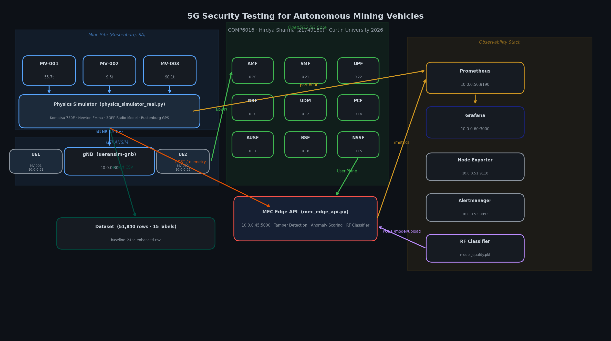

# 5G Security Testing for Autonomous Mining Vehicles

> **COMP6016 — Computer Science Project 2 | Curtin University | Semester 1, 2026**

A full-stack private 5G security testbed for autonomous mining vehicles. The project simulates an Open5GS core, UERANSIM radio access, a physics-based telemetry simulator for Komatsu-style haul trucks, a MEC security API with tamper detection and ML-based scoring, and a Prometheus + Grafana observability layer.



---

## Team — Group 1

| Name | Student ID | Role |
|---|---:|---|
| **Hirdya Sharma** | 21749180 | Infrastructure integration, physics simulator, MEC Edge API, telemetry pipeline |
| Deepika Sharma | 21952195 | Grafana dashboards, Prometheus observability |
| Achani Bandara | 21741102 | ML model training and model artifacts |
| Hitesh Pankhania | 22471264 | Attack execution and packet capture |
| Gurleen Kaur | 22131597 | Attack simulation and Wireshark analysis |

**Supervisors:** Dr. Nasim Ferdosian · Dr. Reza Ryan

---

## What’s in this version

This repository reflects the **current working single-stack layout** from the latest `mining5g_setup` zip.

### Current live architecture
- **Open5GS 5G core** with Dockerised NFs
- **UERANSIM** gNB + 2 UE instances
- **Physics simulator** running `telemetry/physics_simulator_real.py`
- **MEC API** running `mec/mec_edge_api.py`
- **Achani’s ML artifacts integrated into `mec/`**
- **Prometheus + Alertmanager + Node Exporter + Grafana**
- **Single `docker-compose.yml` orchestration**

### Important current runtime ports
These are the ports exposed by the current compose file:

| Service | Container Port | Host Port |
|---|---:|---:|
| MEC Edge API | 5000 | **5001** |
| Physics Simulator | 8000 | **8000** |
| Prometheus | 9090 | **9190** |
| Node Exporter | 9100 | **9110** |
| Alertmanager | 9093 | **9093** |
| Grafana | 3000 | **3000** |
| AMF SCTP | 38412/sctp | **38413/sctp** |

> Use `http://localhost:5001/health` for MEC health checks. The host port is **5001**, not 5000.

---

## Repository structure

```text
mining5g_setup/
├── config/                      # Open5GS + UERANSIM configs
├── mec/                         # MEC API, model config, pickles, datasets
├── telemetry/                   # Physics simulator and telemetry exporter
├── monitoring/                  # Prometheus, Alertmanager, Grafana provisioning
├── mongo-init/                  # Open5GS subscriber bootstrap
├── docs/                        # Architecture diagrams and supporting assets
├── docker-compose.yml           # Full system orchestration
├── setup.sh                     # Fresh Ubuntu setup helper
├── test_everything.sh           # End-to-end validation script
├── fix_subscribers.sh           # Reinsert subscribers if Mongo volume is wiped
├── full_stack_test_report.txt   # Validation notes
└── README.md                    # This file
```

---

## System architecture

```text
Physics Simulator (10.0.0.40) ──POST /telemetry──► MEC Edge API (10.0.0.45)
            │                                           │
            └─────────────── /metrics ─────────────────►│
                                                        ▼
                                                Prometheus (10.0.0.50)
                                                        ▼
                                                   Grafana (10.0.0.60)

UERANSIM gNB/UEs  ───────────────► Open5GS Core ───────────────► MEC/Monitoring
```

### Internal network map

| Container | IP |
|---|---|
| mongo | 10.0.0.2 |
| open5gs-nrf | 10.0.0.10 |
| open5gs-ausf | 10.0.0.11 |
| open5gs-udm | 10.0.0.12 |
| open5gs-udr | 10.0.0.13 |
| open5gs-pcf | 10.0.0.14 |
| open5gs-nssf | 10.0.0.15 |
| open5gs-bsf | 10.0.0.16 |
| open5gs-amf | 10.0.0.20 |
| open5gs-smf | 10.0.0.21 |
| open5gs-upf | 10.0.0.22 |
| ueransim-gnb | 10.0.0.30 |
| ueransim-ue1 | 10.0.0.31 |
| ueransim-ue2 | 10.0.0.32 |
| telemetry-simulator | 10.0.0.40 |
| mec-edge | 10.0.0.45 |
| prometheus | 10.0.0.50 |
| node-exporter | 10.0.0.51 |
| alertmanager | 10.0.0.53 |
| grafana | 10.0.0.60 |

---

## Quick start

### Option A — use the provided setup script

```bash
cd ~/Downloads
unzip mining5g_setup.zip
cd mining5g_setup
chmod +x setup.sh
sudo bash setup.sh
```

### Option B — run directly if Docker is already installed

```bash
cd mining5g_setup
docker compose up -d --build
```

### Check containers

```bash
docker compose ps
```

### Key verification commands

```bash
# MEC health
curl http://localhost:5001/health

# Prometheus targets
curl http://localhost:9190/api/v1/targets

# Grafana
xdg-open http://localhost:3000
```

Grafana login:
- **Username:** `admin`
- **Password:** `mining5g@secure`

---

## Open5GS and UERANSIM

### Core components
The system uses `gradiant/open5gs:2.7.0` containers for NRF, AUSF, UDM, UDR, PCF, NSSF, BSF, AMF, SMF, and UPF.

### UEs
- `ueransim-ue1` → IMSI `999700000000001`
- `ueransim-ue2` → IMSI `999700000000002`

### Quick checks

```bash
# UE registration

docker logs ueransim-ue1 --tail=20
docker logs ueransim-ue2 --tail=20

# UE tunnel interface

docker exec ueransim-ue1 ip addr
docker exec ueransim-ue2 ip addr
```

If Mongo volumes are reset and UEs stop registering, run:

```bash
bash fix_subscribers.sh
```

---

## Physics simulator

### Active simulator
The current stack runs:

```bash
python physics_simulator_real.py
```

inside the `telemetry-simulator` container.

### Important note
- `telemetry/physics_simulator_real.py` = **current simulator in use**
- `telemetry/simulator.py` = older/basic simulator, **not the main one for the current stack**

### What it does
The physics simulator models three autonomous mining vehicles and generates:
- speed
- fuel
- battery
- engine temperature
- payload
- RSRP
- SINR
- RTT
- packet loss
- uplink/downlink throughput
- GPS position

Telemetry is then posted to the MEC API at `/telemetry` and exported via `/metrics`.

### Simulator checks

```bash
# container state

docker ps -a | grep telemetry-simulator

# startup command

docker inspect telemetry-simulator --format='{{.Config.Cmd}} {{.Config.Entrypoint}}'

# logs

docker logs --tail=50 telemetry-simulator
```

---

## MEC Edge API

### Current service location
- Container IP: `10.0.0.45:5000`
- Host access: **`http://localhost:5001`**

### Main endpoints

| Method | Path | Purpose |
|---|---|---|
| GET | `/health` | Liveness, vehicles seen, model status |
| GET | `/metrics` | Prometheus scrape endpoint |
| GET | `/events` | Recent forensic/security events |
| POST | `/telemetry` | Ingest and validate telemetry |
| POST | `/model/upload` | Model hot-swap support |

### Current model files
Achani’s ML artifacts are stored directly in `mec/`:
- `mec/model_attack.pkl`
- `mec/model_protocol.pkl`
- `mec/model_quality.pkl`
- `mec/scaler.pkl`
- `mec/mec_config.json`

### Health check

```bash
curl http://localhost:5001/health
```

### Metrics check

```bash
curl http://localhost:5001/metrics | grep mec_
```

### Valid telemetry test

```bash
curl -X POST http://localhost:5001/telemetry \
  -H "Content-Type: application/json" \
  -d '{
    "vehicle_id":"MV-TEST-1",
    "speed_kmh":22,
    "fuel_liters":2400,
    "battery_percent":84,
    "engine_temp_c":86,
    "rsrp_dbm":-72,
    "rtt_ms":22,
    "packet_loss_percent":0.8,
    "payload_tons":70,
    "sinr_db":21,
    "ul_mbps":18,
    "dl_mbps":75
  }'
```

### Tamper / rejected telemetry test

```bash
curl -X POST http://localhost:5001/telemetry \
  -H "Content-Type: application/json" \
  -d '{
    "vehicle_id":"MV-TEST-2",
    "speed_kmh":56,
    "fuel_liters":2400,
    "battery_percent":84,
    "engine_temp_c":86,
    "rsrp_dbm":-72,
    "rtt_ms":22,
    "packet_loss_percent":0.8,
    "payload_tons":70,
    "sinr_db":21,
    "ul_mbps":18,
    "dl_mbps":75
  }'
```

The second payload should be rejected because the current tamper bounds treat speeds above `55 km/h` as invalid.

---

## ML integration

The current stack uses Achani’s model artifacts within the MEC service rather than a separate ML microservice.

### Current integrated model capabilities
- attack prediction
- protocol prediction
- traffic quality prediction
- anomaly flagging
- tamper-aware rejection path

### Useful metrics to inspect

```bash
curl http://localhost:5001/metrics | grep mec_
```

Typical metrics to expose or visualise include:
- `mec_attack_prediction`
- `mec_attack_predictions_total`
- `mec_protocol_prediction`
- `mec_traffic_quality`
- `mec_achani_flag`
- `mec_anomaly_score`
- `mec_tamper_detected_total`

---

## Grafana and Prometheus

### Prometheus
- URL: `http://localhost:9190`
- scrape interval: 5 seconds

### Grafana
- URL: `http://localhost:3000`
- default dashboard file: `monitoring/grafana/dashboards/mining-telemetry.json`

### Provisioning
Grafana is provisioned from:
- `monitoring/grafana/provisioning/`
- `monitoring/grafana/dashboards/`

### Recommended security / AI panels
These are the most useful panels for the current stack:
- Attack Type Detections
- Predicted Attack per Vehicle
- Traffic Quality per Vehicle
- Protocol per Vehicle
- Achani Flag per Vehicle
- Anomaly Score per Vehicle
- Tamper Detections (5 min)
- Rejected Telemetry % (5 min)

---

## Troubleshooting

### MEC health fails on port 5000
Use port **5001** on the host:

```bash
curl http://localhost:5001/health
```

### Telemetry simulator is stopped

```bash
docker ps -a | grep telemetry-simulator
docker logs --tail=100 telemetry-simulator
docker compose up -d --build telemetry-simulator
```

### Only `/metrics` appears in MEC logs
Prometheus is scraping, but fresh telemetry may not be arriving. Check:

```bash
docker logs --tail=50 telemetry-simulator
docker logs -f mec-edge
```

You should see `POST /telemetry` entries when the simulator is active.

### UE registration issues after wiping volumes

```bash
bash fix_subscribers.sh
docker compose restart ueransim-ue1 ueransim-ue2
```

### Validate compose file

```bash
docker compose config >/dev/null
```

---

## End-to-end test sequence

```bash
# 1. Start everything

docker compose up -d --build

# 2. Check services

docker compose ps

# 3. Check MEC API

curl http://localhost:5001/health
curl http://localhost:5001/metrics | grep mec_

# 4. Check Prometheus

curl http://localhost:9190/api/v1/targets

# 5. Open Grafana
# http://localhost:3000
```

---

## Known practical notes

- The host MEC port is **5001**, while the container listens on **5000**.
- The physics simulator in active use is `physics_simulator_real.py`.
- Some simulator outputs can occasionally trigger tamper rejection if generated values exceed configured bounds.
- ML pickle files are already included in `mec/` in this zip.
- This layout supersedes the older repo design that used separate `mec-edge-api/`, `telemetrics/`, `prometheus/`, and `grafana/` folders.

---

## References

- Open5GS documentation
- UERANSIM documentation
- Prometheus documentation
- Grafana documentation
- Komatsu 730E specification data
- 3GPP NR radio propagation references
- MITRE ATT&CK for ICS

