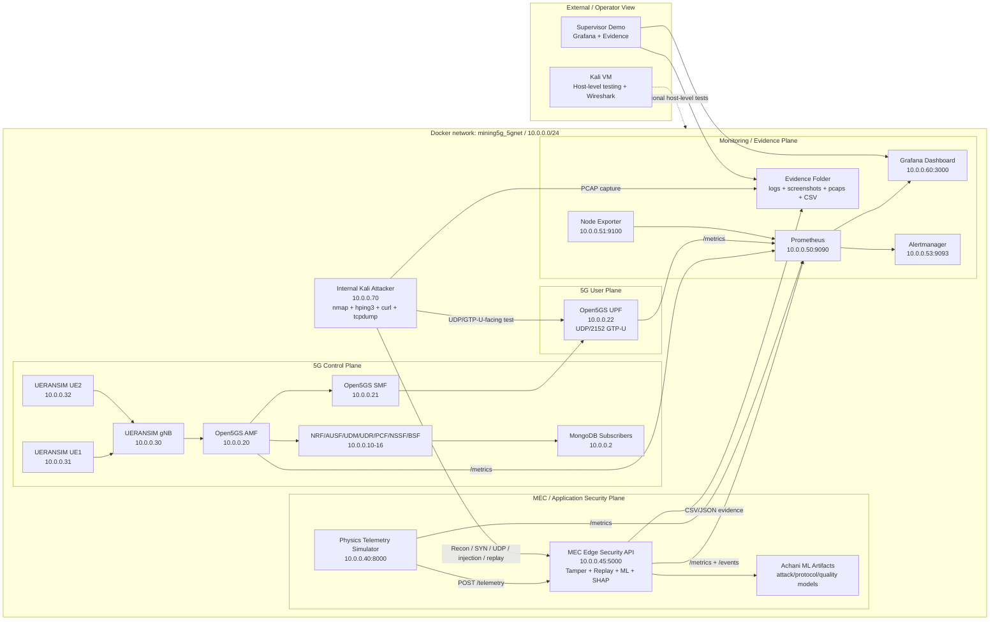

# Architecture: 5G Security Testing for Autonomous Mining Vehicles



## Main Flow

1. UERANSIM simulates UE/gNB behaviour and Open5GS provides the private 5G control/user-plane services.
2. The physics simulator generates mining vehicle telemetry and exposes Prometheus metrics.
3. Telemetry is sent to the MEC Edge API.
4. The MEC API validates telemetry, checks tampering/replay, applies anomaly/model logic, and exports metrics/events.
5. Prometheus scrapes telemetry, MEC, Open5GS AMF/UPF, Node Exporter, and its own health.
6. Grafana visualises vehicle telemetry, 5G planes, MEC security, AI model output, and Kali attack evidence.
7. The internal Kali attacker generates controlled lab-only adversarial tests.
8. Evidence is saved as logs, PCAPs, screenshots, metrics, and exported events.
```
